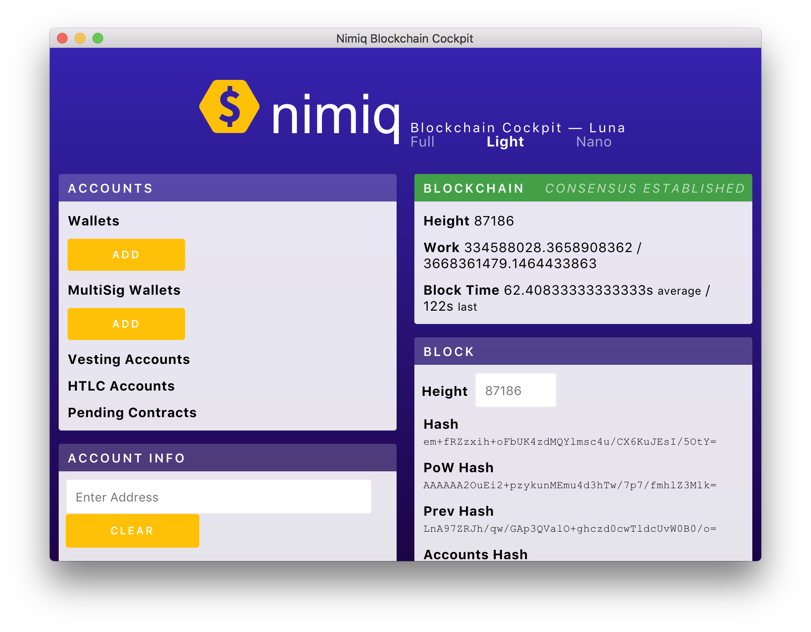

# Nimiq Electron Client


* Minimal integration of Nimiq and Electron
* WebRTC network + Native NodeJS miner



## Get Started

```sh
git clone https://github.com/hanpama/nimiq-electron-client
cd nimiq-electron-client
npm install
npm start
```

## Concepts

* We can take the advantage of NodeJS binded native miner with IPC connection.
* `uws` is not compatible with Electron apps, so it uses WebRTC(Chromium).
